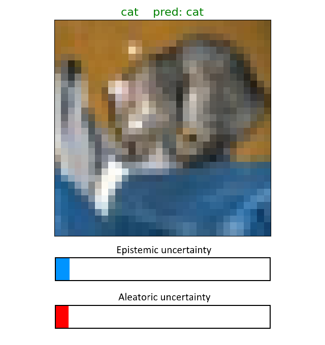
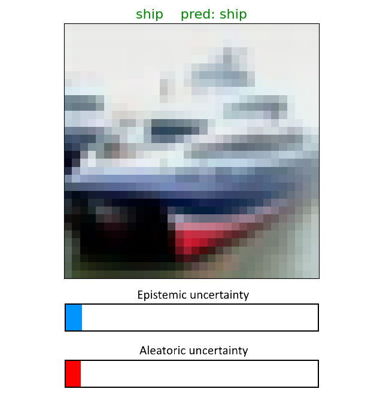

# Deep Evidential EK-NN Framework
Deep Evidential Framework to compute Epistemic and Aleatoric uncertainties.  

The method can simply be plugged on any deep architecture to compute aleatoric and epistemic uncertainties.  

This framework is based on the Evidential K-Nearest Neighbors [Denœux 1995], the idea has been extended to neural networks [Denœux 2000] and a similar idea have been applied to Deep Learning [Tong _et al._ 2021] and Active Learning [Hoarau _et al._ 2024]. From a different litterature, a similar idea has been applied to Out-of-distribution Detection [Sun _et al._ 2022].

## Pre-requisites

### Python modules

The following modules are necessary:
- PyTorch
- Torchvision
- Scikit-learn
- Matplotlib
- Faiss-cpu

### Requirements

The modules can easily be installed with the following code:  
```pip install -r requirements.txt```

## Example on CIFAR-10 with ResNet18

### Acknowledgement

A version of ResNet18 [He _et al._ 2015] is pre-trained thanks to [this code](https://github.com/kuangliu/pytorch-cifar) on the dataset [CIFAR-10](https://www.cs.toronto.edu/~kriz/cifar.html).

### Simple code

```python
# Load CIFAR10 dataset
trainloader, testloader = dataset.load_CIFAR10()

# Load pre-trained ResNet18
ResNet18 = model.load_ResNet18()

# Feedforward the network and extract new feature space
X_train, y_train, X_test, y_test = model.encode_input(trainloader, testloader, ResNet18)

# Number of Nearest Neighbors
K_NEIGHBORS = 8

# Fit Deep EK-NN(nb_classes, nb_neighbors)
estimator = EKNN(10, K_NEIGHBORS)
estimator.fit(X_train, y_train)

# Compute accuracy (if needed)
accuracy = estimator.score(X_test, y_test)

# Compute uncertainties
aleatoric, epistemic = estimator.get_uncertainties(X_test)

print("Model accuracy: %.4f" % accuracy)
print("Mean Epistemic uncertainty: %.4f\n\rMean Aleatoric uncertainty: %.4f" 
      % (np.mean(epistemic), np.mean(aleatoric)))
```

### Output

```
Model accuracy: 0.8976
Mean Epistemic uncertainty: 0.0018
Mean Aleatoric uncertainty: 0.0620
```

### Uncertainties

  


## Reference

When using this code please cite [Hoarau, Waegeman, Quost, Destercke. 2025]

### Related work

K. He, X. Zhang, S. Ren and J. Sun, _Deep Residual Learning for Image Recognition_, IEEE Conference on Computer Vision and Pattern Recognition, 2016

T. Denœux, _A k-nearest neighbor classification rule based on Dempster-Shafer theory_,  IEEE Transactions on Systems, Man, and Cybernetics, 1995

T. Denœux, _A neural network classifier based on Dempster-Shafer theory_, IEEE Transactions on Systems, Man, and Cybernetics, 2000

A. Hoarau, V. Lemaire, Y. Le Gall, JC. Dubois, A. Martin, _Evidential uncertainty sampling strategies for active learning_, Machine Learning, 2024

Z. Tong, P. Xu, T. Denœux, _An evidential classifier based on Dempster-Shafer theory and deep learning_, Neurocomputing, 2021

Y. Sun, Y. Ming, X. Zhu, Y. Li, _Out-of-Distribution Detection with Deep Nearest Neighbors_, https://arxiv.org/abs/2204.06507, 2022
